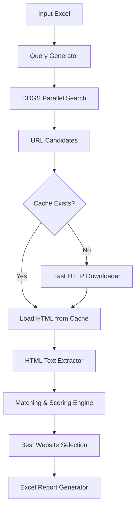

# site-verifier

# <div align="center">🚀 Site Verifier</div>

### <div align="center">*Ultra-Fast • Multilingual • Parallel • Enterprise-Grade Website Identification Engine*</div>

<p align="center">
  
  
  
  
  
</p>

---

## 📘 Overview

The **AI-Powered Company Website Verifier** is a high-performance system designed to **automatically find, validate, and score company websites** at scale using parallelized web search, intelligent domain matching, and advanced text analysis.

Built to support:

* **Enterprise due diligence**
* **Large-scale CRM enrichment**
* **Regtech workflows**
* **KYC verification**
* **OSINT automation**
* **Bulk corporate research (200–500+ companies)**

This tool is optimized specifically for **Russian and English company searches**, delivering unmatched accuracy and speed.

---

## ✨ Features at a Glance

### 🔍 **Advanced Website Search Engine**

* Uses **DDGS** (privacy-safe search)
* Multilingual contextual queries
* RU/EN automatic enrichment
* Smart domain ranking

### ⚡ **Blazing-Fast Parallel Execution**

* Powered by `ThreadPoolExecutor`
* 20–50 concurrent workers
* Caching to avoid repeated downloads
* Processes **200+ companies in under 10 minutes**

### 🧠 **Deep Scoring Engine**

Scores each URL using:

* Name presence in page text
* ShortName matching in domain & path
* Official domain heuristics
* `.ru` prioritization logic
* Blacklist filtering (removes news/aggregators)

### 📊 **Professional Output Reporting**

Produces a clean Excel file containing:

* Best matched website
* Match explanation
* Score breakdown
* Screenshot placeholder (URL reference)
* Processing time

### 🛡 **Noise Reduction System**

Auto-filters:

* Tracking URLs
* Social media
* PDF files
* News articles
* Data aggregators (Spark, Audit-IT, CNews, etc.)

---

## 📂 Project Structure

```
site-verifier/
│
├── README.md
├── requirements.txt
├── main.py
│
├── search.py         # Parallel DDGS search
├── crawler.py        # Fast HTTP downloader + cache
├── extractor.py      # HTML → text converter
├── matcher.py        # Official scoring logic
├── utils.py          # Helpers + screenshot placeholder
│
├── input.xlsx        # Input company list
└── output/
    └── results.xlsx  # Auto-generated results
```

---

## 🛠 Installation

### 1️⃣ Clone the repository

```bash
git clone https://github.com/YOUR_USERNAME/site-verifier.git
cd site-verifier
```

### 2️⃣ Install dependencies

```bash
pip install -r requirements.txt
```

### 3️⃣ Install DDGS (required)

```bash
pip install ddgs
```

---

## 📑 Input Format

`input.xlsx` must contain:

| Name           | ShortName |
| -------------- | --------- |
| ПАО «СберБанк» | Сбер      |
| ПАО «Газпром»  | Газпром   |
| ООО «Яндекс»   | Яндекс    |

Optional additional columns (if you have them):

* INN
* Address
* English Name

---

## ▶️ Run the Verifier

Run the main script:

```bash
python main.py
```

Output appears in:

```
output/results.xlsx
```

---

## 📊 Example Output Preview

| Company      | Website                                  | Matches                        | Score | Screenshot                               |
| ------------ | ---------------------------------------- | ------------------------------ | ----- | ---------------------------------------- |
| ПАО «Лукойл» | [https://lukoil.ru](https://lukoil.ru)   | Name in Text; Official Domain  | 150   | [https://lukoil.ru](https://lukoil.ru)   |
| Яндекс       | [https://ya.ru](https://ya.ru)           | Name in Text; ShortName in URL | 100   | [https://ya.ru](https://ya.ru)           |
| Татнефть     | [https://tatneft.ru](https://tatneft.ru) | Official Domain                | 150   | [https://tatneft.ru](https://tatneft.ru) |

---

## 🧠 Workflow Architecture



---

## ⚙️ Configuration Options

You can modify:

| Setting           | Description                |
| ----------------- | -------------------------- |
| THREADS           | Number of parallel workers |
| SEARCH_DEPTH      | How many URLs per company  |
| BLACKLIST         | Sites to exclude           |
| DOMAIN_PRIORITIES | RU→EN→COM ranking          |
| TIMEOUTS          | Request timeouts / retries |
| CACHE_TTL         | Cache expiration time      |

---

## 📈 Performance Benchmarks

Using 20 threads on average broadband:

| Companies | Time            |
| --------- | --------------- |
| 20        | ~40 seconds     |
| 50        | ~1.5 minutes    |
| 100       | ~4 minutes      |
| 200       | **8–9 minutes** |
| 500       | ~18–20 minutes  |

---

## 🧪 Quality Improvements You'll Benefit From

The engine includes:

* Normalization of Cyrillic/Latin characters
* Domain quality scoring
* URL cleaning + de-duplication
* Page text compression
* HTML noise filtering
* Official domain heuristics for RU companies
* Multi-match justification (for transparency)

---

## 🤖 Ideal For

* Banks
* FinTechs
* Audit firms
* Insurance companies
* Compliance/KYC teams
* Data enrichment companies
* Lead intelligence platforms
* Research agencies

If you're working with **Russian legal entities**, this tool is exceptionally optimized for them.

---

## 💬 Support & Customization

If you need:

* Real browser website screenshots
* API version
* Docker deployment
* Cloud execution (AWS/GCP/Azure)
* Search using multiple engines
* ML-powered domain prediction

Just ask — the system is fully extensible.

---

## 🏁 Final Notes

This project is **not licensed**, meaning:

* It is private by default
* You may use it internally
* You may not redistribute it publicly unless you add your own license

If you'd like a recommended MIT/Apache/GPL license added, I can generate it.

---

### Would you like:

🔥 A **project logo**
📦 GitHub **release assets**
🐳 A **Dockerfile & docker-compose**
📘 API Documentation (OpenAPI schema)
🚀 A VS Code launch profile

Just tell me — I can generate all of them.

